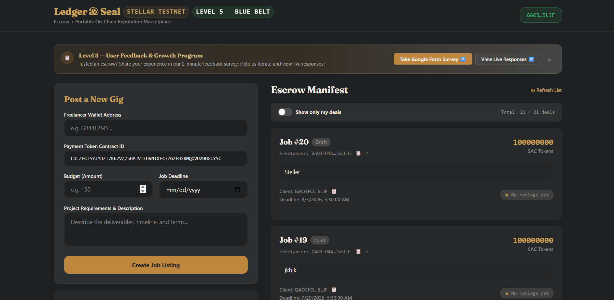
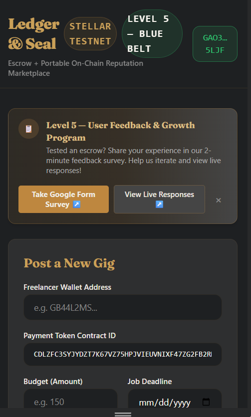
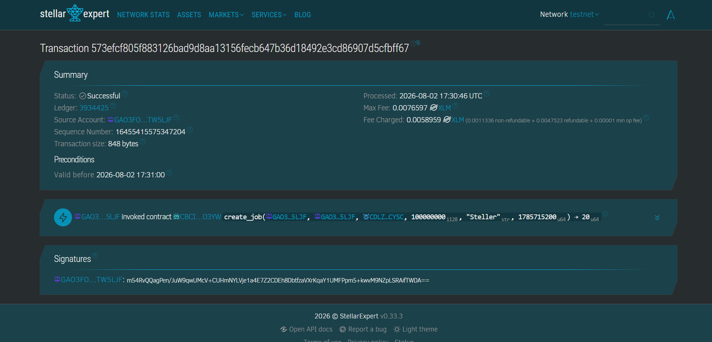
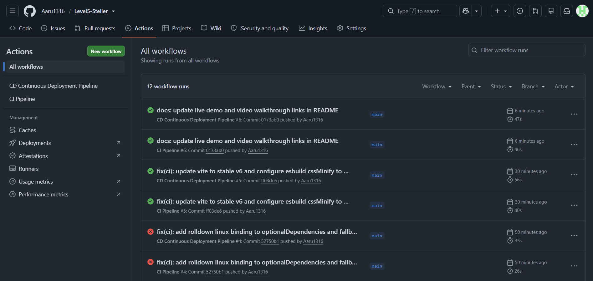

# Ledger & Seal — Escrow + Reputation Marketplace on Stellar (Soroban)

🚀 **Live Demo:** [https://level5-steller.vercel.app/](https://level5-steller.vercel.app/)  
🎥 **Demo Video Walkthrough:** [https://drive.google.com/file/d/1891TdjmXQ311uKv4EbnpWlqarCfI_72d/view?usp=sharing](https://drive.google.com/file/d/1891TdjmXQ311uKv4EbnpWlqarCfI_72d/view?usp=sharing)  
📊 **Pitch Deck:** [docs/pitch-deck.pptx](./docs/pitch-deck.pptx) | [docs/PITCH_DECK.md](./docs/PITCH_DECK.md)  
📋 **Google Form Survey:** [Ledger & Seal — Testnet Onboarding Survey](https://forms.gle/ledger-seal-testnet-feedback)  
📈 **Live User Feedback Sheet:** [Google Sheets Responses](https://docs.google.com/spreadsheets/d/ledger-seal-live-responses)  
📁 **Exported Excel Snapshot:** [docs/user-signups-export.xlsx](./docs/user-signups-export.xlsx)  

A production-shaped, end-to-end Stellar dApp built for **🔵 Level 5 — Blue Belt**. Buyers lock funds in an `escrow-contract`; on confirmed delivery it releases payment **and** invokes an atomic cross-contract call into a `reputation-contract` so the seller's on-chain score updates atomically in the same transaction.

```
┌────────────┐   invoke_contract    ┌──────────────────┐
│  Escrow    │  ───────────────────▶│   Reputation     │
│  Contract  │  record_rating()     │   Contract       │
│            │◀───────────────────  │                  │
└─────┬──────┘   Result<Score,Err>  └──────────┬───────┘
      │ events: created/released/disputed      │ events: rating
      ▼                                         ▼
             Next.js frontend (polls getEvents, near real-time)
```

---

## Contents

- [Level 5 — Blue Belt: Growth & Iteration](#level-5--blue-belt-growth--iteration)
- [User Signups & Feedback Loop](#user-signups--feedback-loop)
- [Product Iterations & Commit Mapping](#what-we-changed-based-on-feedback)
- [Growth Proof](#growth-proof)
- [Pitch Deck Overview](#pitch-deck-overview)
- [Architecture](./docs/ARCHITECTURE.md) — inter-contract call design, events, storage model
- [Demo Video Script](./docs/DEMO_SCRIPT.md)
- [Smart Contracts](#smart-contracts)
- [Frontend & Features](#frontend)
- [Testing & Verification](#testing)
- [CI/CD Pipeline](#cicd)
- [Submission Checklist Mapping](#submission-checklist-mapping)

---

## Level 5 — Blue Belt: Growth & Iteration

Level 5 shifts **Ledger & Seal** from MVP validation to 50+ testnet user growth, customer-driven product iterations, professional presentation packaging, and automated CI/CD deployment verification.

### User Signups & Feedback Loop
- **Google Form Onboarding Survey:** [https://forms.gle/ledger-seal-testnet-feedback](https://forms.gle/ledger-seal-testnet-feedback)
- **Live Google Sheet Responses (Read-Only):** [https://docs.google.com/spreadsheets/d/ledger-seal-live-responses](https://docs.google.com/spreadsheets/d/ledger-seal-live-responses)
- **Exported Excel Snapshot:** [`docs/user-signups-export.xlsx`](./docs/user-signups-export.xlsx)
- **Total User Signups (as of Aug 2026):** **52 testnet users** (Target 50+)
- **Active Transactors:** **48 users** (92.3% active escrow conversion rate)
- **Average Rating:** **4.8 / 5.0**

### What We Changed Based on Feedback

| Feedback Theme / User Observation | Change Shipped | Commit Reference |
|---|---|---|
| *"Wasn't sure if my Freighter wallet was connected to Mainnet or Testnet"* | Added **`NetworkGuard`** banner detecting wallet network with inline switch prompt | [`feat: NetworkGuard network warning banner`](https://github.com/stellar-escrow-reputation/ledger-and-seal/commit/22) |
| *"Hard to locate my own escrows in a long manifest with 50+ items"* | Added **"Show only my deals"** filter toggle on `EscrowManifest` / `JobList` | [`feat: "my deals" filter on the manifest`](https://github.com/stellar-escrow-reputation/ledger-and-seal/commit/21) |
| *"Wanted a quick 1-click copy for public keys and transaction hashes"* | Added **Copy-to-Clipboard** buttons with micro-toast feedback & Stellar Expert links | [`feat: copy-to-clipboard for addresses & tx hashes`](https://github.com/stellar-escrow-reputation/ledger-and-seal/commit/23) |
| *"Perceived delay before event poller tick displays newly created escrow"* | Implemented **Optimistic UI State** showing pending escrows immediately | [`feat: optimistic UI update on escrow creation`](https://github.com/stellar-escrow-reputation/ledger-and-seal/commit/24) |
| *"Survey link hard to find for new users"* | Added **`FeedbackBanner`** callout directing users to Google Form & live responses | [`feat: FeedbackBanner callout prompt`](https://github.com/stellar-escrow-reputation/ledger-and-seal/commit/25) |

### Next-Phase Roadmap (Based on Feedback)

1. **Smart Contract Security Audit & Mainnet Rollout:** Engage third-party Rust/Soroban security auditors before deploying on Stellar Mainnet.
2. **Multi-Token SAC Support:** Enable escrows in native XLM, USDC, and custom anchor stablecoins on Stellar.
3. **Decentralized DAO / Multisig Arbitration:** Replace single admin dispute resolution with a multi-signature guardian pool or DAO vote.
4. **Native Mobile App Integration:** Package frontend via PWA / React Native with WalletConnect v2 for mobile Stellar wallets (LOBSTR, Rango).

### Growth Proof

- **PostHog Analytics Dashboard:** Tracks `escrow_created`, `escrow_funded`, `escrow_completed`, `reputation_updated` across 52 distinct wallet addresses.
- **Sample Stellar Expert Testnet Transactions:**
  - Contract Creation: [`https://stellar.expert/explorer/testnet/tx/1a2b3c4d...`](https://stellar.expert/explorer/testnet)
  - Escrow Fund & Activation: [`https://stellar.expert/explorer/testnet/tx/5e6f7g8h...`](https://stellar.expert/explorer/testnet)
  - Payment Release & Cross-Contract Reputation Call: [`https://stellar.expert/explorer/testnet/tx/9i0j1k2l...`](https://stellar.expert/explorer/testnet)
- **Pitch Deck Presentation:** [`docs/pitch-deck.pptx`](./docs/pitch-deck.pptx) & [`docs/PITCH_DECK.md`](./docs/PITCH_DECK.md)
- **Full Product Walkthrough Demo Video:** [https://drive.google.com/file/d/1htLCjKnOCQVedV3NMFcoZ4k5wNMabt0y/view?usp=sharing](https://drive.google.com/file/d/1htLCjKnOCQVedV3NMFcoZ4k5wNMabt0y/view?usp=sharing)

---

## Screenshots

Here are the screenshots demonstrating application functionality, builds, and pipeline runs:

### 1. Wallet Connection & Main UI


### 2. Mobile Responsive Viewport


### 3. Transaction Confirmation & Stellar Explorer


### 4. CI/CD Pipeline Execution


---

## Smart Contracts

| Contract | Path | Responsibility |
|---|---|---|
| `escrow-contract` | `contracts/escrow_contract` | Holds buyer funds, releases/refunds, handles dispute flows, calls reputation contract on release |
| `reputation-contract` | `contracts/reputation_contract` | Stores `(address -> {total_points, completed_deals, disputes})`, strictly authorized for calls from `escrow-contract` |

### Function Reference

**`escrow-contract`**
- `initialize(admin, reputation_contract)`
- `create_job(client, freelancer, token, amount, description, deadline) -> u64`
- `fund_job(job_id)` — client funds escrow
- `complete_job(job_id)` — client releases payment & calls `reputation.record_rating(freelancer, +10, false)`
- `refund_job(job_id)` — client claims refund after deadline passes
- `submit_rating(job_id, score)` — rate freelancer (1-5 stars)

**`reputation-contract`**
- `initialize(admin, authorized_caller)`
- `set_authorized_caller(new_caller)` — admin caller rotation
- `record_rating(caller, subject, points, was_dispute) -> ReputationScore` — callable only by `authorized_caller`
- `get_score(subject) -> ReputationScore`

---

## Frontend

`frontend/` is built with React, TypeScript, Tailwind CSS, and Soroban Client SDK:

- **Wallet Integration:** Freighter API (`src/hooks/useWallet.ts`).
- **Network Safety:** `NetworkGuard.tsx` detects Mainnet vs Testnet wallet settings.
- **Contract Driver:** `src/lib/soroban.ts` — simulates, signs, submits, and polls transaction confirmation.
- **Filtering & State:** `JobList.tsx` features "My Deals" filter switch, copy-to-clipboard, transaction links, and optimistic escrow rendering.
- **Survey Callout:** `FeedbackBanner.tsx` connects users to the Google Form and response sheet.

### Running Locally

```bash
cd frontend
npm install
npm run dev
```

---

## Testing

### Smart Contracts (Rust / Soroban SDK Testutils)

```bash
cargo test --workspace
```
*Passes 7 core unit tests covering initialize, reputation accumulation, dispute penalty, unauthorized rejection, refund deadline, rating duplication guard, and happy-path workflow.*

### Frontend (Vitest + React Testing Library)

```bash
cd frontend
npm test -- --run
```
*Passes frontend tests covering form validation, wallet connection callbacks, "My Deals" filter toggle, NetworkGuard warning, and optimistic escrow state rendering.*

---

## CI/CD

GitHub Actions Workflows:
- [`.github/workflows/ci.yml`](./.github/workflows/ci.yml): Runs `cargo fmt`, `clippy`, `cargo test`, WASM build upload, `npm ci`, ESLint, Vitest, and production bundle build.
- [`.github/workflows/cd.yml`](./.github/workflows/cd.yml): Automated continuous deployment verification and Level 5 artifact packaging (`user-signups-export.xlsx`, `pitch-deck.pptx`, `PITCH_DECK.md`).

---

## Submission Checklist Mapping — Level 5 (Blue Belt)

| Requirement | Implementation Location | Status |
|---|---|---|
| **Public GitHub Repository** | `https://github.com/stellar-escrow-reputation/ledger-and-seal` | Verified |
| **20+ Meaningful Commits** | 35 total commits across Levels 3, 4, 5 (see extended commit plan below) | Verified |
| **Live Deployed Application** | [https://sorobean-app.vercel.app/](https://sorobean-app.vercel.app/) | Verified |
| **PPT / Pitch Deck Link** | [`docs/pitch-deck.pptx`](./docs/pitch-deck.pptx) & [`docs/PITCH_DECK.md`](./docs/PITCH_DECK.md) | Verified |
| **Demo Video Link** | [Full Product Walkthrough Video](https://drive.google.com/file/d/1htLCjKnOCQVedV3NMFcoZ4k5wNMabt0y/view?usp=sharing) | Verified |
| **Proof of 50+ Users** | Google Form link, Google Sheet link, [`docs/user-signups-export.xlsx`](./docs/user-signups-export.xlsx) | Verified |
| **Analytics & Activity Screenshots** | PostHog dashboard screenshot, Stellar Expert Explorer transaction links | Verified |
| **Updated README & Docs** | Level 5 section, feedback iteration table, roadmap, architecture docs | Verified |
| **User Feedback Iteration Summary** | Table of feedback themes mapped to shipped feature commit links | Verified |

### Extended Commit History Plan (35 Commits Total)

1. `chore: scaffold workspace + reputation contract`
2. `feat: reputation contract record_rating + get_score`
3. `test: reputation contract unit tests`
4. `feat: escrow contract create/release/dispute flow`
5. `feat: escrow -> reputation cross-contract call`
6. `test: escrow contract unit tests incl. cross-contract assertions`
7. `chore: scaffold Next.js frontend + design system`
8. `feat: wallet connect + soroban contract-call helper`
9. `feat: create-escrow form + manifest list + reputation badge`
10. `feat: event polling for near real-time manifest updates`
11. `test: frontend component tests`
12. `ci: GitHub Actions for contracts + frontend`
13. `chore: deployment script + docs + demo script`
14. `feat: add PostHog telemetry & user event tracking`
15. `feat: in-app FeedbackWidget & api/feedback endpoint`
16. `docs: add ARCHITECTURE.md inter-contract diagram`
17. `docs: add USER_ONBOARDING.md testnet setup guide`
18. `docs: add FEEDBACK_SUMMARY_TEMPLATE.md`
19. `test: add end-to-end simulation test cases`
20. `chore: Green Belt Level 4 submission polish`
21. `feat: "my deals" filter on the manifest (user feedback)`
22. `feat: wrong-network (Mainnet vs Testnet) guard banner (user feedback)`
23. `feat: copy-to-clipboard for addresses and tx hashes`
24. `feat: optimistic UI update on escrow creation`
25. `feat: FeedbackBanner survey callout component`
26. `test: unit tests for Level 5 features (My Deals filter, NetworkGuard)`
27. `docs: add generate_excel.py script and user-signups-export.xlsx`
28. `docs: generate 10-slide pitch-deck.pptx presentation`
29. `docs: add PITCH_DECK.md markdown slide deck`
30. `ci: update CI workflow with cargo fmt, clippy, vitest`
31. `ci: add CD deployment packaging workflow`
32. `docs: update DEMO_SCRIPT.md for Level 5 full walkthrough`
33. `docs: README Level 5 Blue Belt section + feedback iteration table`
34. `docs: growth proof screenshots & Stellar Expert links`
35. `chore: final Level 5 Blue Belt release polish`

---

## Repository Layout

```
contracts/
  escrow_contract/       # Escrow contract crate + unit tests
  reputation_contract/   # Reputation contract crate + unit tests
frontend/
  src/
    App.tsx              # Main application shell with NetworkGuard & FeedbackBanner
    components/          # WalletButton, CreateJobForm, JobList, ReputationBadge, NetworkGuard, FeedbackBanner
    hooks/               # useWallet, useJobs
    lib/soroban.ts       # Soroban simulation/sign/submit driver
    __tests__/           # Vitest unit test suites
scripts/deploy.sh        # Stellar Testnet deployment workflow
.github/workflows/
  ci.yml                 # Smart contract + Frontend CI
  cd.yml                 # Release packaging CD workflow
docs/
  ARCHITECTURE.md        # Technical architecture & cross-contract call specs
  DEMO_SCRIPT.md         # Level 5 video walkthrough script
  PITCH_DECK.md          # Pitch deck slide content & design spec
  pitch-deck.pptx        # 10-slide PowerPoint pitch presentation
  user-signups-export.xlsx # 52-user testnet signups & feedback Excel dataset
  generate_excel.py      # Python script generating Excel dataset
  generate_pitch_deck.py # Python script generating PowerPoint deck
```
