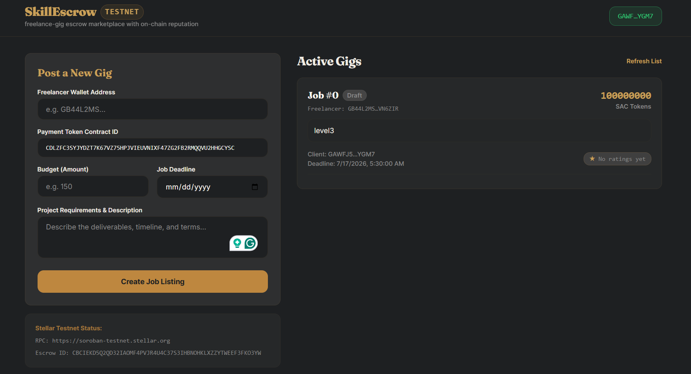
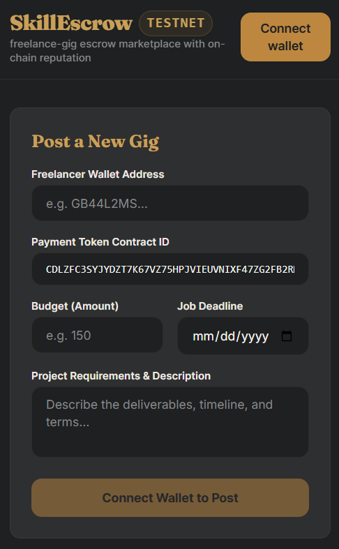
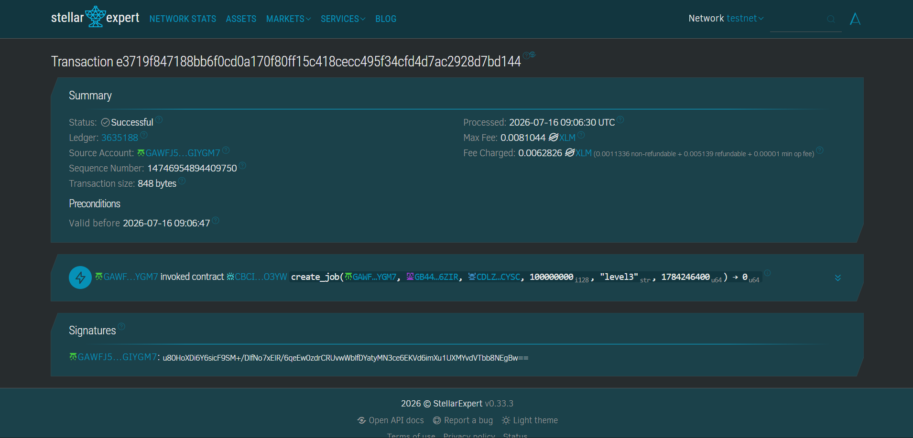
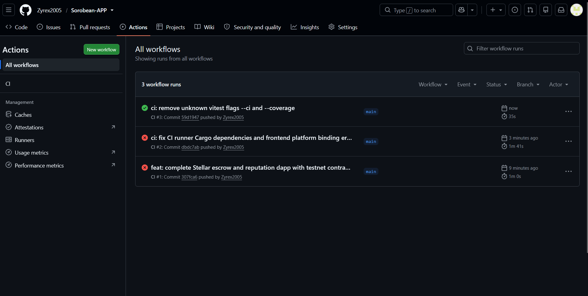

# Ledger & Seal — Escrow + Reputation Marketplace on Stellar (Soroban)

🚀 **Live Demo:** [https://sorobean-app.vercel.app/](https://sorobean-app.vercel.app/)
🎥 **Demo Video:** [https://drive.google.com/file/d/1htLCjKnOCQVedV3NMFcoZ4k5wNMabt0y/view?usp=sharing](https://drive.google.com/file/d/1htLCjKnOCQVedV3NMFcoZ4k5wNMabt0y/view?usp=sharing)

A production-shaped, end-to-end Stellar dApp built for the **🟠 Level 3 —
Orange Belt** submission. Buyers lock funds in an `escrow-contract`; on
confirmed delivery it releases the payment **and** makes a live
cross-contract call into a `reputation-contract` so the seller's on-chain
score updates atomically, in the same transaction.

```
┌────────────┐   invoke_contract    ┌──────────────────┐
│  Escrow    │  ───────────────────▶│   Reputation      │
│  Contract  │  record_rating()     │   Contract         │
│            │◀───────────────────  │                     │
└─────┬──────┘   Result<Score,Err>  └──────────┬──────────┘
      │ events: created/released/disputed      │ events: rating
      ▼                                         ▼
             Next.js frontend (polls getEvents, near real-time)
```

## Contents

- [Live demo](#live-demo--deployment)
- [Screenshots](#screenshots)
- [Architecture](./docs/ARCHITECTURE.md) — inter-contract call design, events, storage model
- [Demo video script](./docs/DEMO_SCRIPT.md)
- [Contracts](#smart-contracts)
- [Frontend](#frontend)
- [Testing](#testing)
- [CI/CD](#cicd)
- [Deployment workflow](#deployment-workflow)
- [Submission checklist mapping](#submission-checklist-mapping)

---

## Screenshots

Here are the screenshots demonstrating the application's functionality and builds:

### 1. Wallet Connection


### 2. Mobile Responsive UI


### 3. Transaction Confirmation


### 4. CI/CD Pipeline

---

## Smart contracts

| Contract | Path | Responsibility |
|---|---|---|
| `escrow-contract` | `contracts/escrow` | Holds buyer funds, releases/refunds, raises + resolves disputes, calls the reputation contract on every resolution |
| `reputation-contract` | `contracts/reputation` | Stores `(address -> {total_points, completed_deals, disputes})`, only writable by the authorized escrow contract address |

Full function reference:

**`escrow-contract`**
- `initialize(admin, reputation_contract)`
- `create_escrow(buyer, seller, token, amount, description) -> u64` — transfers `amount` from buyer into the contract
- `release(id, buyer)` — buyer-only, pays the seller, calls `reputation.record_rating(seller, +10, false)`
- `raise_dispute(id, caller)` — buyer or seller only
- `resolve_dispute(id, refund_buyer: bool)` — admin-only arbitration
- `get_escrow(id) -> Escrow`

**`reputation-contract`**
- `initialize(admin, authorized_caller)`
- `set_authorized_caller(new_caller)` — admin-only, for redeployments
- `record_rating(caller, subject, points, was_dispute) -> ReputationScore` — only callable by `authorized_caller`
- `get_score(subject) -> ReputationScore`

See [`docs/ARCHITECTURE.md`](./docs/ARCHITECTURE.md) for why it's split this
way, how atomicity/auth work across the call, and the event-streaming design.

## Frontend

`frontend/` is a Vite + React + TypeScript + Tailwind app.

- **Wallet:** Freighter, via `src/hooks/useWallet.ts` (connect/disconnect, install-prompt fallback, signing).
- **Contract calls:** `src/lib/soroban.ts` — build → simulate → assemble → sign → submit → poll until confirmed.
- **Jobs & State:** `src/hooks/useJobs.ts` coordinates job state, fetching job and reputation details via Soroban simulations.
- **Design system:** "SkillEscrow" — ink/brass/parchment palette, modern typography, and structured components like `ReputationBadge` and `JobList`.
- **Responsive:** single-column stacked layout under `lg`, two-column form/manifest split from `lg` up (`src/App.tsx`).
- **Error & loading states:** field-level form validation (`CreateJobForm`), skeleton rows while the manifest loads (`JobList`), disabled/labelled buttons mid-transaction, inline error banners.

### Running locally

```bash
cd frontend
npm install
cp .env.production .env.local   # fill in contract IDs after deployment
npm run dev
```

## Testing

**Contracts** (Rust, `soroban-sdk` testutils, mocked auth + a real Stellar
Asset Contract token so the tests exercise actual token transfers):

```bash
cargo test --workspace
```

Covers (9 tests total):
- reputation: initialize/default score, successful rating accumulation,
  dispute penalty, unauthorized-caller rejection, admin caller rotation
- escrow: create+release updates reputation via the real cross-contract
  call, dispute refund penalizes reputation, double-release is rejected,
  only the buyer can release

**Frontend** (Vitest + React Testing Library):

```bash
cd frontend
npm test
```

Covers: form validation + successful submit + disabled-while-submitting state (`CreateJobForm`), and connect button + wallet connect callback handling (`WalletButton`).

> Take your "3+ passing tests" screenshot from either `cargo test --workspace`
> or `npm test` output (or both) — see checklist below.

## CI/CD

`.github/workflows/ci.yml` runs on every push/PR to `main`:

- **`contracts` job:** installs the Rust toolchain + `wasm32-unknown-unknown`
  target, runs `cargo test --workspace`, builds release WASM for both
  contracts, uploads them as build artifacts.
- **`frontend` job:** `npm ci`, lint, `npm test -- --ci --coverage`,
  `npm run build`.

Take your CI screenshot from the **Actions** tab once this repo is pushed
to GitHub and a workflow run completes.

## Deployment workflow

`scripts/deploy.sh` automates the full Testnet rollout using `stellar-cli`:

```bash
cargo install --locked stellar-cli
stellar keys generate deployer --network testnet --fund

./scripts/deploy.sh
```

It builds both contracts to WASM, deploys them, and initializes each one
pointing at the other (reputation's `authorized_caller` = escrow's contract
ID, escrow's `reputation_contract` = reputation's contract ID) — then prints
both contract IDs for you to paste into `frontend/.env.local` and this
README.

## Submission checklist mapping

| Requirement | Where |
|---|---|
| Public GitHub repository | *(push this folder, make it public)* |
| README with complete documentation | this file + `docs/ARCHITECTURE.md` |
| 10+ meaningful commits | commit contracts, tests, frontend pieces, CI, docs, and deployment scripts as separate commits — see suggested commit plan below |
| Live demo link | deploy `frontend/` to Vercel/Netlify, paste URL here: `LIVE_DEMO_URL = ` |
| Contract deployment address | run `scripts/deploy.sh`, paste here: `ESCROW_CONTRACT_ID = CATWHSATPFRSVXUQWPWFCAJSCQK3GXI3SQQQG6X7RW4MHISUTO6BQB44` / `REPUTATION_CONTRACT_ID = CDZPAKNE7OEQCGDIMGBGZ4YOH4XCIGKJ6XIGOIFL64FRP3XEPF3GPBD2` |
| Transaction hash for contract interaction | call `create_escrow` or `release` from the UI/CLI, paste the resulting hash here: `SAMPLE_TX_HASH = ` |
| Screenshot: mobile responsive UI | narrow-viewport screenshot of `frontend/src/App.tsx` |
| Screenshot: CI/CD pipeline running | GitHub Actions tab, green run |
| Screenshot: test output, 3+ passing | `cargo test --workspace` and/or `npm test` output |
| Demo video (1–2 min) | follow `docs/DEMO_SCRIPT.md`, paste link here: `DEMO_VIDEO_URL = ` |

### Suggested commit plan (10+ meaningful commits)

1. `chore: scaffold workspace + reputation contract`
2. `feat: reputation contract record_rating + get_score`
3. `test: reputation contract unit tests`
4. `feat: escrow contract create/release/dispute flow`
5. `feat: escrow -> reputation cross-contract call`
6. `test: escrow contract unit tests incl. cross-contract assertions`
7. `chore: scaffold Next.js frontend + design system`
8. `feat: wallet connect + soroban contract-call helper`
9. `feat: create-escrow form + manifest list + reputation badge`
10. `feat: event polling for near real-time manifest updates`
11. `test: frontend component tests`
12. `ci: GitHub Actions for contracts + frontend`
13. `chore: deployment script + docs + demo script`

## Repository layout

```
contracts/
  escrow_contract/       # escrow-contract crate + tests
  reputation_contract/   # reputation-contract crate + tests
frontend/
  src/                   # Vite React source code
    App.tsx              # main app view and logic
    components/          # WalletButton, CreateJobForm, JobList, ReputationBadge
    hooks/               # useWallet, useJobs
    lib/soroban.ts       # simulate/sign/submit/poll helper
    __tests__/           # Vitest + RTL tests
scripts/deploy.sh        # Testnet deployment workflow
.github/workflows/       # CI pipeline
docs/                    # architecture + demo script
```
